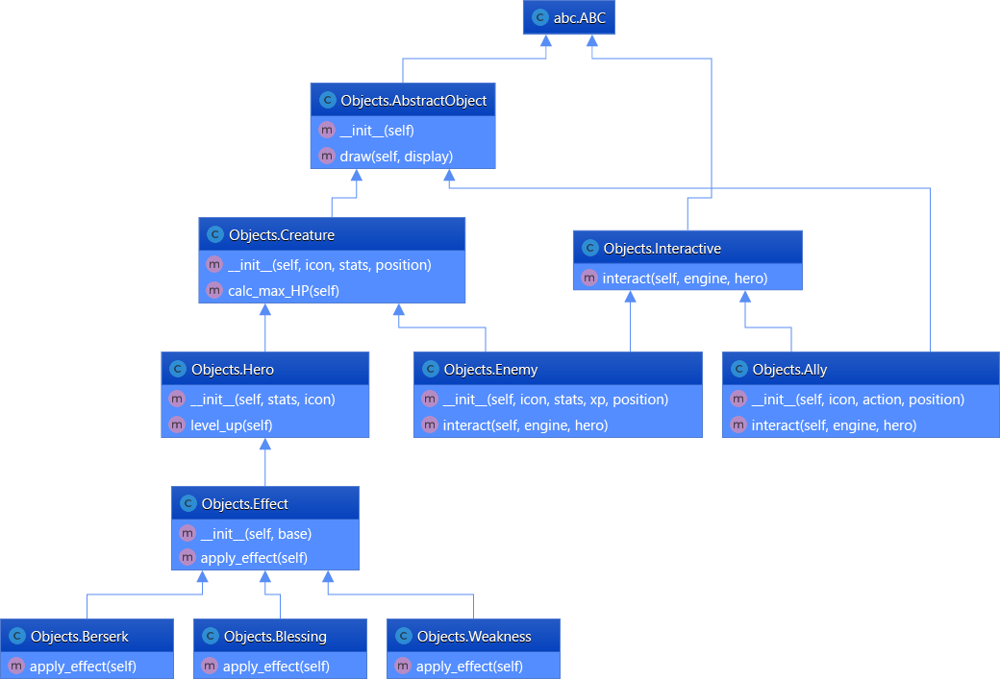
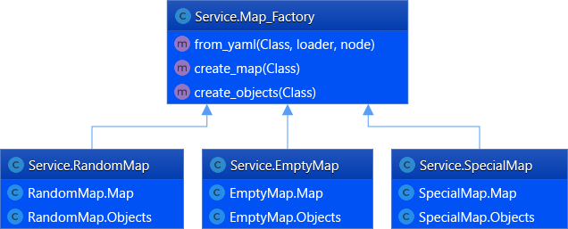

## Final Project Description
This simple python game based on opensource PyGame Library.

Motivation of this project is to investigate set of OOP patterns.
In code and UML below:
  * Observer pattern(GameEngine class) to notify player in InfoWindow about game events
  * Decorator (Effect class) pattern to apply effects on Hero
  * AbstractFabric (MapFactory class) to create game maps and objects
  * Chain of Responsibility (ScreenHandle based class) to provide sequantial drawing of objects
  

### Start Screen 

### Gameplay 

### Objects Diagram

### Service Diagram

### ScreenEngine Diagram

